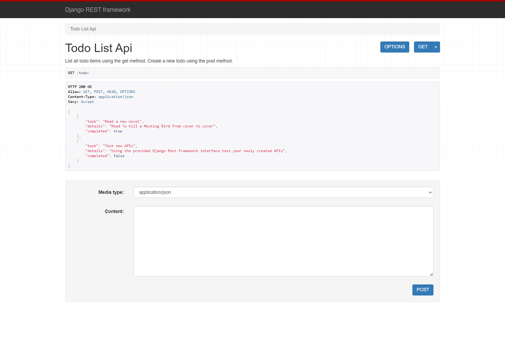
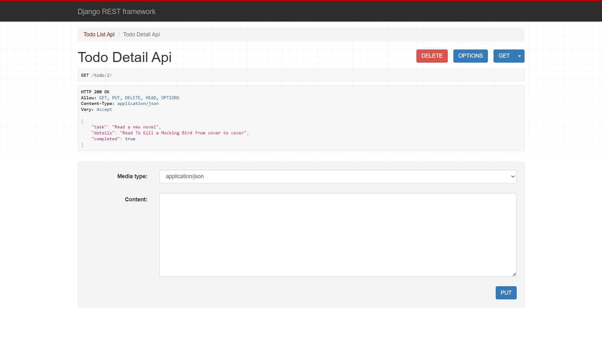
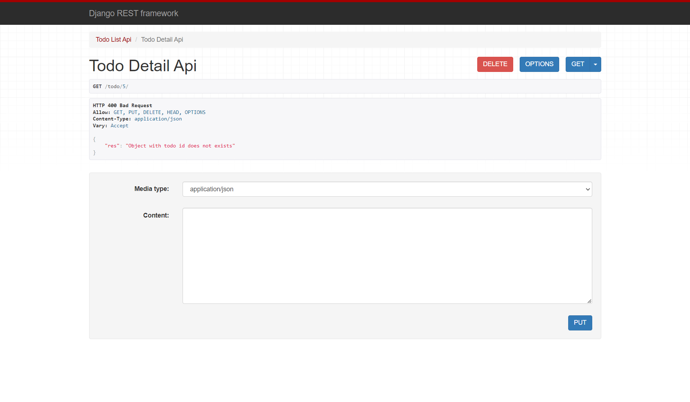

# Building REST APIs using Django Rest Framework

- Why DRF?
- Setting up DRF
- RESTful structure: GET, POST, PUT and DELETE methods
- Creating models for APIs
- Model Serializer
- Creating API Views in Django

## Why Django Rest Framework?

- Built on top of Django
- Powerful and flexible toolkit for Web APIs
- Based on Django's Class-based views
- It adopts implementation of forms, model validator, Querysets

## Setting up Django Rest Framework

1. Create and activate a virtual environment:

    ```shell
    python -m venv todo_venv
    ```

    on Windows:

    ```shell
    todo_venv/Scripts/activate
    ```

    on Linux:

    ```shell
    source todo_venv/bin/activate
    ```

2. Install Django

    ```shell
    pip install Django
    ```

3. Create a Django project called todo with the following command:

    ```shell
    django-admin startproject first_api .
    ```

4. Install Django Rest Framework and register it in `settings.py`:

    ```shell
    pip install djangorestframework
    ```

    in `settings.py`:

    ```python
    INSTALLED_APPS = [
        # ...
        "rest_framework",
    ]
    ```

5. create a new app for your API:

    ```shell
    django-admin startapp todo
    ```

    in `settings.py`:

    ```python
    INSTALLED_APPS = [
        # ...
        "todo.apps.TodoConfig",
    ]
    ```

## RESTful structure: *GET,* *POST*, *PUT*, and *DELETE* methods

In a RESTful API, endpoints define the structure and usage with the `GET`, `POST`, `PUT`, and `DELETE` HTTP methods. You must organize these methods logically.

To show how to build a RESTful app with Django REST framework, we’ll create an example to-do API. We’ll use two endpoints with their respective HTTP methods, as shown in the table below:

| Endpoint | `GET` | `POST` | `PUT` | `DELETE` |
|----------|-------|--------|-------|----------|
| `todo/` | 1. List All: List all to-dos for requested user | 2. Create: Add a new to-do | N/A | N/A |
| `todo/<int:todo_id>` | 3. Retrieve: Get a to-do with given `todo_id` | N/A | 4. Update: Update a to-do with given `todo_id` | 5. Delete: Delete a to-do with given `todo_id` |

1. **Creating models for our Django app**

    Let’s start by creating the model for our to-do list add the following code in the `todo/models.py` file:

    ```python
    from django.db import models

    class Todo(models.Model):
        task = models.CharField(max_length=200)
        details = models.CharField(max_length=500)
        created = models.DateTimeField(auto_now_add=True)
        completed = models.BooleanField(default=False)
        updated = models.DateTimeField(auto_now=True)
        
        def __str__(self):
            return self.task
    ```

    After creating the model, migrate it to the database.

    ```shell
    python manage.py makemigrations
    python manage.py migrate
    ```

2. **Model serializer**

    The first thing we need to get started on our Web API is to provide a way of serializing and deserializing the data into representations such as json. We can do this by declaring serializers that work very similar to Django's forms.

    To convert the Model object to an API-appropriate format like JSON, Django REST framework uses the ModelSerializer class to convert any model to serialized JSON objects. 

    In the `todo` app directory create a new file called `serializers.py` and add the following code to it:

    ```python
    from rest_framework import serializers
    from .models import Todo

    class TodoSerializer(serializers.ModelSerializer):
        class Meta:
            model = Todo
            fields = ['task', 'details', 'completed']
    ```

    In the same way that Django provides both `Form` classes and `ModelForm` classes, REST framework includes both `Serializer` classes, and `ModelSerializer` classes.

    A serializer class is very similar to a Django Form class, and includes similar validation flags on the various fields, such as `required`, `max_length` and `default`.

    The field flags can also control how the serializer should be displayed in certain circumstances, such as when rendering to HTML. The `{'base_template': 'textarea.html'}` flag above is equivalent to using widget=widgets.Textarea on a Django Form class. This is particularly useful for controlling how the browsable API should be displayed.

## Creating API views in Django

**List view**

The first API view class deals with the `todos/` endpoint, in which it handles `GET` for listing all to-dos and `POST` for creating a new to-do. Add the following code to the `todo/views.py` file:

```python
from rest_framework.views import APIView
from rest_framework.response import Response
from rest_framework import status
from .models import Todo
from .serializers import TodoSerializer


class TodoListApiView(APIView):
    """
    List all todo items using the get method.
    Create a new todo using the post method.
    """
    
    def get(self, request, *args, **kwargs):
        """
        List all the todo items
        """
        # Get all todos
        todos = Todo.objects.all()
        
        # Validate the data using the serializer
        serializer = TodoSerializer(todos, many=True)
        
        # Return data and status code
        return Response(serializer.data, status=status.HTTP_200_OK)
        
    def post(self, request, *args, **kwargs):
        """
        Create a todo with given data from the request object.
        """
        
        # Create a dictionary with data passed from the request object.
        data = {
            'task': request.data.get('task'),
            'details': request.data.get('details'), 
            'completed': request.data.get('completed')
        }
        
        # Pass the data dictionary to the serializer
        serializer = TodoSerializer(data=data)
        
        # Check if data passed through serializer is valid
        if serializer.is_valid():
            
            # if data is valid save it/create new object
            serializer.save()
            
            # Return the serialized and status code
            return Response(serializer.data, status=status.HTTP_201_CREATED)
        
        # if data is not valid return errors and error code
        return Response(serializer.errors, status=status.HTTP_400_BAD_REQUEST)
```

The `GET()` method first fetches all the objects from the model. Then, it serializes from the model object to a JSON serialized object. Next, it returns the response with serialized data and status as 200_OK.

The `POST()` method fetches the requested data and adds it in the data dictionary. Next, it creates a serialized object and saves the object if it’s valid. If valid, it returns the `serializer.data`, which is a newly created object with status as `201_CREATED`. Otherwise, it returns the `serializer.errors` with status as `400_BAD_REQUEST`.

Create an endpoint for the class-based view above:

1. Create a new file called `urls.py` in the `todo` app directory and add the following code to it:

    ```python
    from .views  import TodoListApiView
    from django.urls import path

    app_name = 'todo'

    urlpatterns = [
        path('', TodoListApiView.as_view(), name='todo-list'),
    ]
    ```

2. In the `first_api/urls.py` file modify the code to look like this:

    ```python
    from django.contrib import admin
    from django.urls import path, include

    urlpatterns = [
        path("admin/", admin.site.urls),
        path('todo/', include('todo.urls', namespace='todo')),
    ]
    ```

Test out the the API by running the development server:

```shell
python manage.py runserver
```

In your browser navigate to [`http://127.0.0.1:8000/todo/`](http://127.0.0.1:8000/todo/)

You should see something similar to this:



Enter a few items in the `content` input box using `JSON` format and they should appear on the list above.

This page is called the browsable API. API may stand for Application Programming Interface, but humans have to be able to read the APIs, too; someone has to do the programming. Django REST Framework supports generating human-friendly HTML output for each resource when the `HTML` format is requested. These pages allow for easy browsing of resources, as well as forms for submitting data to the resources using `POST`, `PUT`, and `DELETE`.

**Detail view**

Now that we’ve successfully created our first endpoint view, let’s create the second endpoint `todos/<int:todo_id>/` API view.

In this API view class, we need to create three methods for handling the corresponding HTTP methods, `GET`, `PUT`, and `DELETE`, as discussed above. Add the following code to the `todo/views.py` file:

```python
class TodoDetailApiView(APIView):

    def get_object(self, todo_id):
        '''
        Helper method to get the object with given todo_id
        '''
        try:
            return Todo.objects.get(id=todo_id)
        except Todo.DoesNotExist:
            return None

    # 3. Retrieve
    def get(self, request, todo_id, *args, **kwargs):
        '''
        Retrieves the Todo with given todo_id
        '''
        todo_instance = self.get_object(todo_id)
        if not todo_instance:
            return Response(
                {"res": "Object with todo id does not exists"},
                status=status.HTTP_400_BAD_REQUEST
            )

        serializer = TodoSerializer(todo_instance)
        return Response(serializer.data, status=status.HTTP_200_OK)

    # 4. Update
    def put(self, request, todo_id, *args, **kwargs):
        '''
        Updates the todo item with given todo_id if exists
        '''
        todo_instance = self.get_object(todo_id)
        if not todo_instance:
            return Response(
                {"res": "Object with todo id does not exists"}, 
                status=status.HTTP_400_BAD_REQUEST
            )
        data = {
            'task': request.data.get('task'), 
            'completed': request.data.get('completed'), 
            'user': request.user.id
        }
        serializer = TodoSerializer(instance = todo_instance, data=data, partial = True)
        if serializer.is_valid():
            serializer.save()
            return Response(serializer.data, status=status.HTTP_200_OK)
        return Response(serializer.errors, status=status.HTTP_400_BAD_REQUEST)

    # 5. Delete
    def delete(self, request, todo_id, *args, **kwargs):
        '''
        Deletes the todo item with given todo_id if exists
        '''
        todo_instance = self.get_object(todo_id)
        if not todo_instance:
            return Response(
                {"res": "Object with todo id does not exists"}, 
                status=status.HTTP_400_BAD_REQUEST
            )
        todo_instance.delete()
        return Response(
            {"res": "Object deleted!"},
            status=status.HTTP_200_OK
        )
```

The `GET()` method first fetches the object with the ID `todo_id`. If the requested object is not available, it returns the response with the status as `400_BAD_REQUEST`. Otherwise, it serializes the model object to a `JSON` serialized object and returns the response with serializer.data and status as `200_OK`.

The `PUT()` method fetches the to-do object if it is available in the database, updates its data with requested data, and saves the updated data in the database.

The `DELETE()` method fetches the to-do object if is available in the database, deletes it, and responds with a response.

Update the file `todo/urls.py` as demonstrated below:

```python
from .views import TodoListApiView, TodoDetailApiView

urlpatterns = [
    # ...
    path('<int:todo_id>/', TodoDetailApiView.as_view(), name='todo-detail'),
]
```

Now, if you navigate to `http://127.0.0.1:8000/todo/<id>/`, it will show the detail API view page. Notice that you correctly navigate to a valid ID. In the screenshot below, I used 2 as the ID:



If you navigate using an invalid ID:

